# Kylin Messenger 架构文档

本文档使用Mermaid图表描述Kylin Messenger的程序结构和架构设计。

重要更新：自 1.2 起，协议层已统一为 IPMSG/FeiQ 文本协议；历史自定义二进制协议与 ProtoBuf 编解码路径已移除，仅保留 IPMSG 语义与实现。

## 系统整体架构

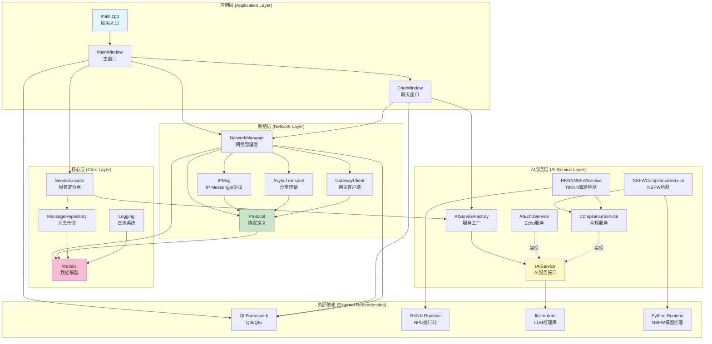

## 分层架构详细视图

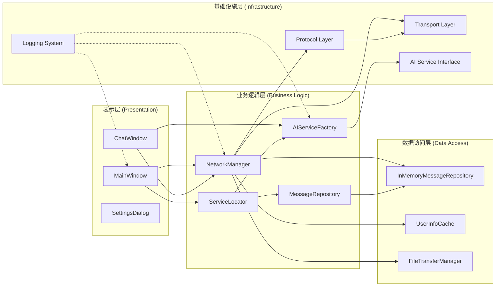

## 核心模块类图

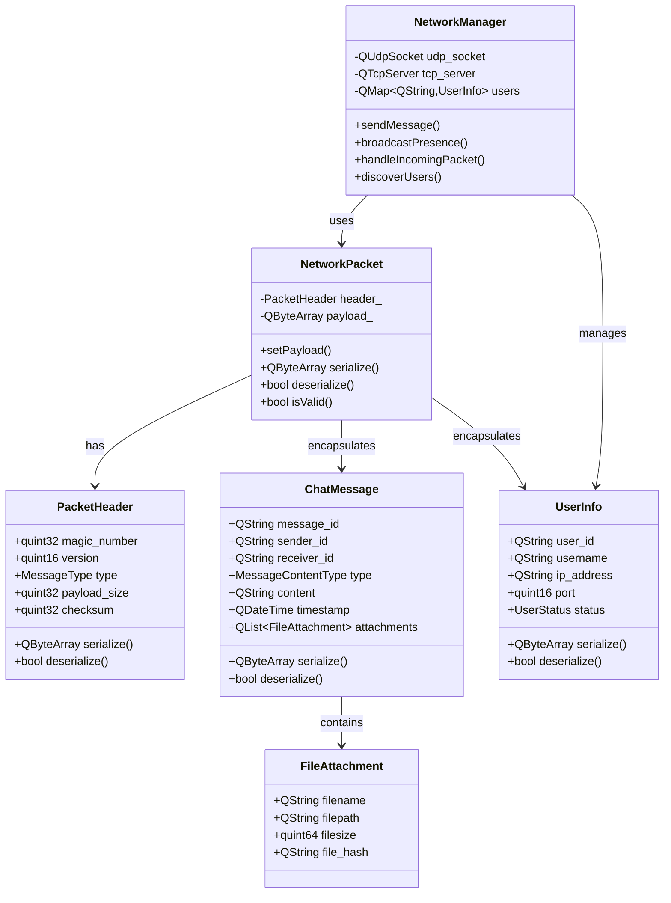

## AI服务架构

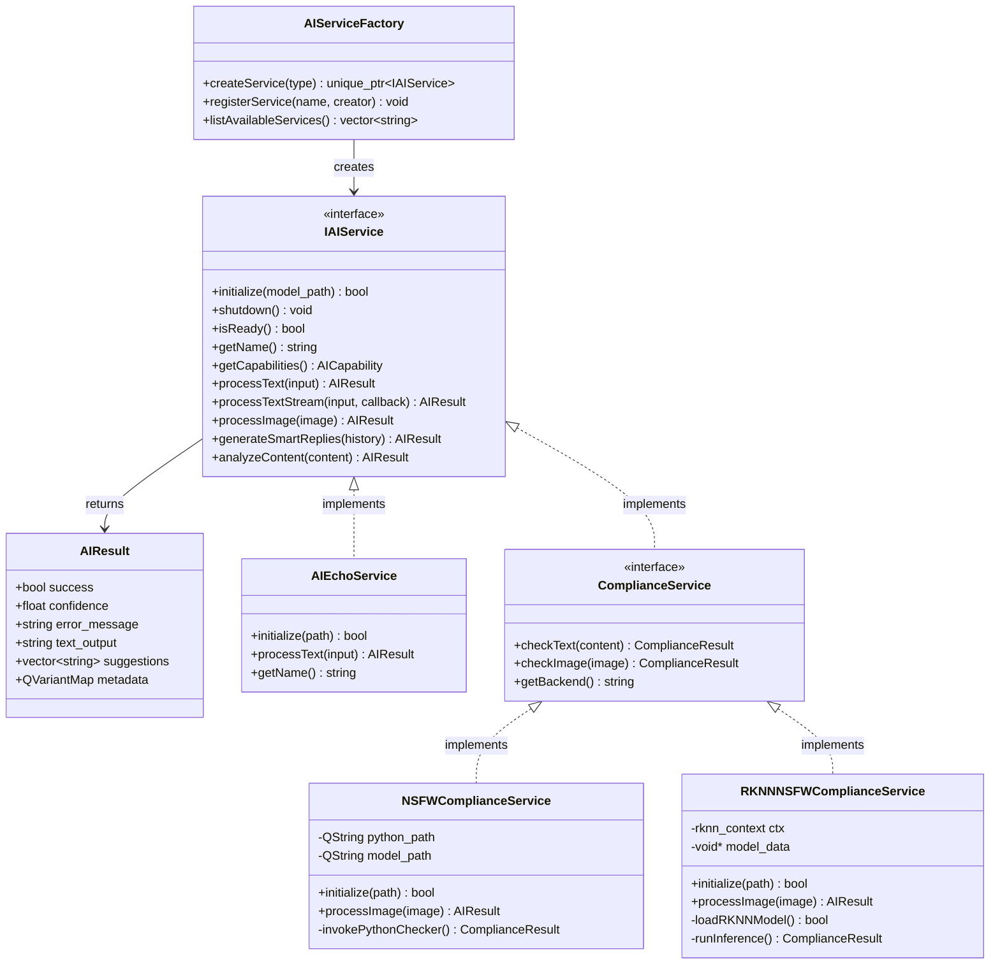

## 网络通信时序图

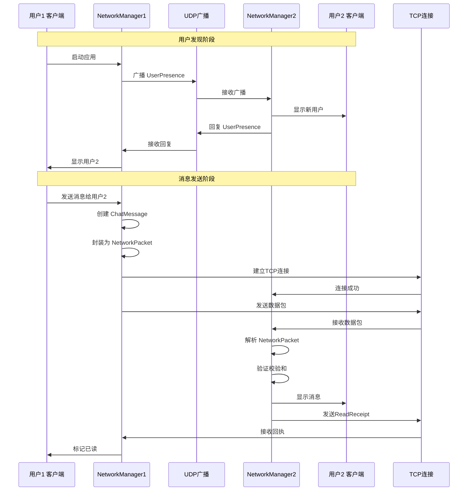

## 消息处理流程

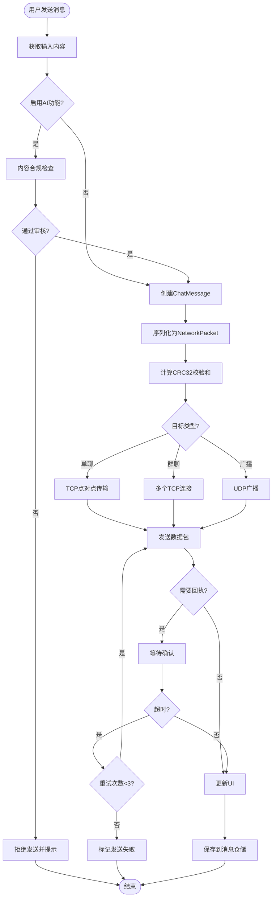

## 文件传输流程

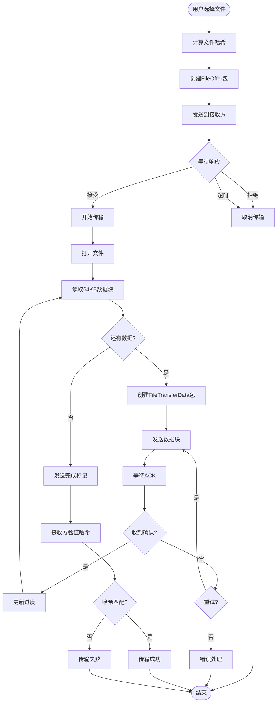

## 依赖注入架构

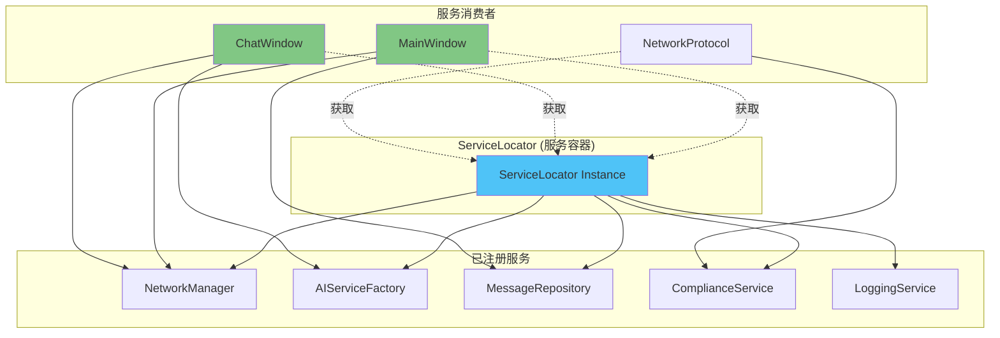

## 数据流图

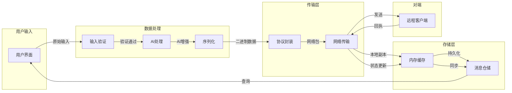

## 编译构建流程

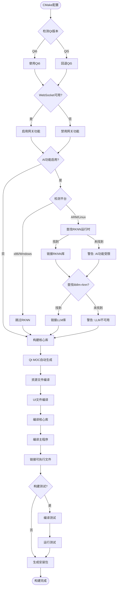

## 部署架构

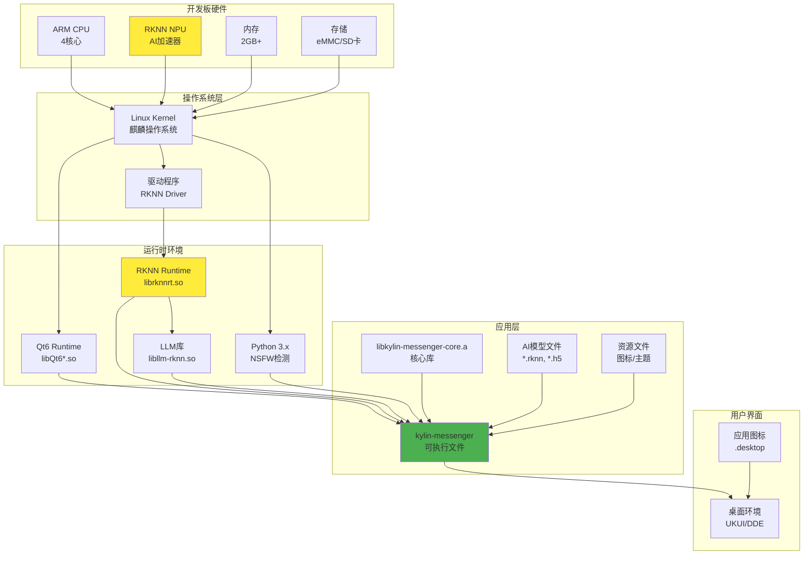

## 项目目录结构

```mermaid
graph TD
    Root[kylin-messenger/] --> Include[include/<br/>头文件]
    Root --> Src[src/<br/>源代码]
    Root --> Tests[tests/<br/>单元测试]
    Root --> Resources[resources/<br/>资源文件]
    Root --> UI[ui/<br/>UI定义文件]
    Root --> Debian[debian/<br/>打包配置]
    Root --> CMake[CMakeLists.txt<br/>构建配置]
    
    Include --> IncCore[core/<br/>核心模块]
    Include --> IncNetwork[network/<br/>网络模块]
    Include --> IncAI[ai_service.h等<br/>AI接口]
    Include --> IncUtils[utils/<br/>工具类]
    
    Src --> SrcCore[core/<br/>核心实现]
    Src --> SrcNetwork[network/<br/>网络实现]
    Src --> SrcUI[ui/<br/>UI实现]
    Src --> SrcServices[services/<br/>服务实现]
    Src --> SrcMain[main.cpp<br/>程序入口]
    
    SrcCore --> Models[models.cpp<br/>数据模型]
    SrcCore --> Logging[logging.cpp<br/>日志系统]
    SrcCore --> DI[di/service_locator.cpp<br/>依赖注入]
    SrcCore --> Repo[repositories/<br/>仓储层]
    
    SrcNetwork --> IPMsg[ipmsg.cpp<br/>协议实现]
    SrcNetwork --> NetMgr[network_manager.cpp<br/>网络管理]
    SrcNetwork --> Transport[async_transport.cpp<br/>传输层]
    SrcNetwork --> Gateway[gateway_client.cpp<br/>网关客户端]
    
    SrcUI --> MainWin[main_window.cpp<br/>主窗口]
    SrcUI --> ChatWin[chat_window.cpp<br/>聊天窗口]
    
    SrcServices --> Compliance[compliance服务<br/>内容审核]
    
    Resources --> Icons[icons/<br/>图标资源]
    Resources --> Emojis[emojis/<br/>表情包]
    Resources --> QSS[qss/<br/>样式表]
    Resources --> Scripts[scripts/<br/>脚本资源]
    
    style Root fill:#e3f2fd
    style Include fill:#fff3e0
    style Src fill:#f1f8e9
    style Resources fill:#fce4ec
```

---

## 说明

以上Mermaid图表从多个维度展示了Kylin Messenger的架构设计：

1. **系统整体架构**: 展示应用、核心、网络、AI四大层次及其依赖关系
2. **分层架构**: 体现表示层、业务逻辑层、数据访问层、基础设施层的分层设计
3. **核心模块类图**: 详细展示关键数据结构和类的关系
4. **AI服务架构**: 展示AI服务的抽象接口和具体实现的继承关系
5. **网络通信时序图**: 描述用户发现和消息传递的完整流程
6. **消息处理流程**: 展示消息从输入到发送的完整处理流程
7. **文件传输流程**: 描述文件传输的详细步骤
8. **依赖注入架构**: 展示ServiceLocator模式的应用
9. **数据流图**: 展示数据在各层之间的流动
10. **编译构建流程**: 描述CMake构建过程的决策树
11. **部署架构**: 展示从硬件到应用的完整部署栈
12. **项目目录结构**: 展示源代码的组织结构

这些图表可以使用支持Mermaid的Markdown查看器（如GitHub、GitLab、Typora、VSCode等）查看。

